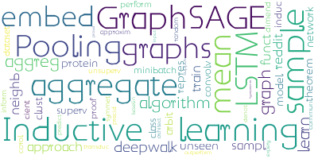
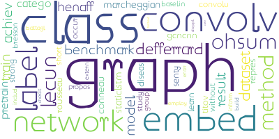

# 2019 spring semester

---

- **Date:** 2019.04.08

- **Reporter:** Xin Ruyue

- **Title:** Modeling Relational Data with Graph Convolutional Networks

- **Keywords:**
 

- **Abstract:** Knowledge graphs enable a wide variety of applications, in- cluding question answering and information retrieval. De- spite the great effort invested in their creation and mainte- nance, even the largest (e.g., Yago, DBPedia or Wikidata) remain incomplete. We introduce Relational Graph Convo- lutional Networks (R-GCNs) and apply them to two standard knowledge base completion tasks: Link prediction (recovery of missing facts, i.e. subject-predicate-object triples) and en- tity classification (recovery of missing entity attributes). R- GCNs are related to a recent class of neural networks operat- ing on graphs, and are developed specifically to deal with the highly multi-relational data characteristic of realistic knowl- edge bases. We demonstrate the effectiveness of R-GCNs as a stand-alone model for entity classification. We further show that factorization models for link prediction such as DistMult can be significantly improved by enriching them with an en- coder model to accumulate evidence over multiple inference steps in the relational graph, demonstrating a large improve- ment of 29.8% on FB15k-237 over a decoder-only baseline.

- **Slide link:** http://210.31.72.204/f/487

---

- **Date:** 2019.04.01

- **Reporter:** Wang Shuo

- **Title:** GCN, GAT, GraphSAGE 框架回顾及其 PyG 复现

- **Slide link:** http://210.31.72.204/f/488

---

- **Date:** 2019.03.25

- **Reporter:** Liu Jing

- **Title:** Combinatorial Optimization with Graph Convolutional Networks and Guided Tree Search

- **Keywords:**
 

- **Abstract:** We present a learning-based approach to computing solutions for certain NP- hard problems. Our approach combines deep learning techniques with useful algorithmic elements from classic heuristics. The central component is a graph convolutional network that is trained to estimate the likelihood, for each vertex in a graph, of whether this vertex is part of the optimal solution. The network is designed and trained to synthesize a diverse set of solutions, which enables rapid exploration of the solution space via tree search. The presented approach is evaluated on four canonical NP-hard problems and five datasets, which include benchmark satisfiability problems and real social network graphs with up to a hundred thousand nodes. Experimental results demonstrate that the presented approach substantially outperforms recent deep learning work, and performs on par with highly optimized state-of-the-art heuristic solvers for some NP-hard problems. Experiments indicate that our approach generalizes across datasets, and scales to graphs that are orders of magnitude larger than those used during training.

- **Slide link:** http://210.31.72.204/f/486

---

- **Date:** 2019.03.18

- **Reporter:** Gu Weiwei

- **Title:** Hyperspherical Variational Auto-Encoders

- **Keywords:**
 

- **Abstract:** The Variational Auto-Encoder (VAE) is one of the most used unsupervised machine learning models. But although the default choice of a Gaussian distribution for both the prior and posterior represents a mathematically convenient distribution often leading to competitive results, we show that this parameterization fails to model data with a latent hyperspherical structure. To address this issue we propose using a von Mises-Fisher (vMF) distribution instead, leading to a hyperspherical latent space. Through a series of experiments we show how such a hyperspherical VAE, or -VAE, is more suitable for capturing data with a hyperspherical latent structure, while outperforming a normal, -VAE, in low dimensions on other data types.

- **Slide link:** http://210.31.72.204/f/484

---

- **Date:** 2019.03.11

- **Reporter:** Gao Fei

- **Title:** MODELING RELATIONAL DATA WITH GRAPH CONVOLUTIONAL NETWORKS

- **Keywords:**
 

- **Abstract:** Knowledge graphs enable a wide variety of applications, including question answering and information retrieval. Despite the great effort invested in their creation and maintenance, even the largest (e.g., Yago, DBPedia or Wikidata) remain incomplete. We introduce Relational Graph Convolutional Networks (R-GCNs) and apply them to two standard knowledge base completion tasks: Link prediction (recovery of missing facts, i.e. subject-predicate-object triples) and entity classification (recovery of missing entity attributes). R-GCNs are related to a recent class of neural networks operating on graphs, and are developed specifically to deal with the highly multi-relational data characteristic of realistic knowledge bases. We demonstrate the effectiveness of R-GCNs as a stand-alone model for entity classification. We further show that factorization models for link prediction such as DistMult can be significantly improved by enriching them with an encoder model to accumulate evidence over multiple inference steps in the relational graph, demonstrating a large improvement of 29.8% on FB15k-237 over a decoder-only baseline.

- **Slide link:** 

# 2018 autumn semester

<!-- 
- **Date:** 

- **Reporter:** 

- **Title:** 

- **Abstract:**

- **Slide link:**  -->

- **Date:** 2019.1.7

- **Reporter:** Chen Mengyuan

- **Title:** Every Node Counts: Self-Ensembling Graph Convolutional Networks for Semi-Supervised Learning

- **Keywords:**
 

- **Abstract:** Graph convolutional network (GCN) provides a powerful means for graph-based semi-supervised tasks. However, as a localized first-order approximation of spectral graph convolution, the classic GCN can not take full advantage of unlabeled data, especially when the unlabeled node is far from labeled ones. To capitalize on the information from unlabeled nodes to boost the training for GCN, we propose a novel framework named Self-Ensembling GCN (SEGCN), which marries GCN with Mean Teacher - another powerful model in semi-supervised learning. SEGCN contains a student model and a teacher model. As a student, it not only learns to correctly classify the labeled nodes, but also tries to be consistent with the teacher on unlabeled nodes in more challenging situations, such as a high dropout rate and graph collapse. As a teacher, it averages the student model weights and generates more accurate predictions to lead the student. In such a mutual-promoting process, both labeled and unlabeled samples can be fully utilized for backpropagating effective gradients to train GCN. In three article classification tasks, i.e. Citeseer, Cora and Pubmed, we validate that the proposed method matches the state of the arts in the classification accuracy.

- **Slide link:** http://210.31.72.204/f/480

---

- **Date:** 2018.12.24

- **Reporter:** Mou Muyun

- **Title:** Inductive Representation Learning on Large Graphs

- **Keywords:**
 

- **Abstract:** Low-dimensional embeddings of nodes in large graphs have proved extremely useful in a variety of prediction tasks, from content recommendation to identifying protein functions. However, most existing approaches require that all nodes in the graph are present during training of the embeddings; these previous approaches are inherently transductive and do not naturally generalize to unseen nodes. Here we present GraphSAGE, a general, inductive framework that leverages node feature information (e.g., text attributes) to efficiently generate node embeddings for previously unseen data. Instead of training individual embeddings for each node, we learn a function that generates embeddings by sampling and aggregating features from a node's local neighborhood. Our algorithm outperforms strong baselines on three inductive node-classification benchmarks: we classify the category of unseen nodes in evolving information graphs based on citation and Reddit post data, and we show that our algorithm generalizes to completely unseen graphs using a multi-graph dataset of protein-protein interactions.

- **Slide link:** http://210.31.72.204/f/479

---

- **Date:** 2018.12.17

- **Reporter:** Gao Fei

- **Title:** Learning Dynamic Embeddings from Temporal Interactions

- **Keywords:**
 

- **Abstract:** Modeling a sequence of interactions between users and items (e.g., products, posts, or courses) is crucial in domains such as e-commerce, social networking, and education to predict future interactions. Representation learning presents an attractive solution to model the dynamic evolution of user and item properties, where each user/item can be embedded in a euclidean space and its evolution can be modeled by dynamic changes in embedding. However, existing embedding methods either generate static embeddings, treat users and items independently, or are not scalable. 
Here we present JODIE, a coupled recurrent model to jointly learn the dynamic embeddings of users and items from a sequence of user-item interactions. JODIE has three components. First, the update component updates the user and item embedding from each interaction using their previous embeddings with the two mutually-recursive Recurrent Neural Networks. Second, a novel projection component is trained to forecast the embedding of users at any future time. Finally, the prediction component directly predicts the embedding of the item in a future interaction. For models that learn from a sequence of interactions, traditional training data batching cannot be done due to complex user-user dependencies. Therefore, we present a novel batching algorithm called t-Batch that generates time-consistent batches of training data that can run in parallel, giving massive speed-up. 
We conduct six experiments on two prediction tasks---future interaction prediction and state change prediction---using four real-world datasets. We show that JODIE outperforms six state-of-the-art algorithms in these tasks by up to 22.4%. Moreover, we show that JODIE is highly scalable and up to 9.2x faster than comparable models. As an additional experiment, we illustrate that JODIE can predict student drop-out from courses five interactions in advance.

- **Slide link:** http://210.31.72.204/f/477

---

- **Date:** 2018.12.10

- **Reporter:** Lou Xiaodan

- **Title:** Graph Convolutional Networks for Text Classification

- **Keywords:**
 

- **Abstract:** Text classification is an important and classical problem in natural language processing. There have been a number of studies that applied convolutional neural networks (convolution on regular grid, e.g., sequence) to classification. However, only a limited number of studies have explored the more flexible graph convolutional neural networks (convolution on non-grid, e.g., arbitrary graph) for the task. In this work, we propose to use graph convolutional networks for text classification. We build a single text graph for a corpus based on word co-occurrence and document word relations, then learn a Text Graph Convolutional Network (Text GCN) for the corpus. Our Text GCN is initialized with one-hot representation for word and document, it then jointly learns the embeddings for both words and documents, as supervised by the known class labels for documents. Our experimental results on multiple benchmark datasets demonstrate that a vanilla Text GCN without any external word embeddings or knowledge outperforms state-of-the-art methods for text classification. On the other hand, Text GCN also learns predictive word and document embeddings. In addition, experimental results show that the improvement of Text GCN over state-of-the-art comparison methods become more prominent as we lower the percentage of training data, suggesting the robustness of Text GCN to less training data in text classification.

- **Slide link:** http://210.31.72.204/f/475

---

- **Date:** 2018.12.3

- **Reporter:** Li Benji

- **Title:** Career on the Move: Geography,Stratification, and Scientific Impact

- **Slide link:** http://210.31.72.204/f/474

---

- **Date:** 2018.12.3

- **Reporter:** Wang Lifei

- **Title:** 介绍了利用互信息重构网络和Gaussian Graphic Model

- **Slide link:** http://210.31.72.204/f/473 and http://210.31.72.204/f/472

---

- **Date:** 2018.11.26

- **Reporter:** Huang Yu

- **Title:** Deep Interest Evolution Network for Click-Through Rate Prediction

- **Abstract:** Click-through rate~(CTR) prediction, whose goal is to estimate the probability of the user clicks, has become one of the core tasks in advertising systems. For CTR prediction model, it is necessary to capture the latent user interest behind the user behavior data. Besides, considering the changing of the external environment and the internal cognition, user interest evolves over time dynamically. There are several CTR prediction methods for interest modeling, while most of them regard the representation of behavior as the interest directly, and lack specially modeling for latent interest behind the concrete behavior. Moreover, few work consider the changing trend of interest. In this paper, we propose a novel model, named Deep Interest Evolution Network~(DIEN), for CTR prediction. Specifically, we design interest extractor layer to capture temporal interests from history behavior sequence. At this layer, we introduce an auxiliary loss to supervise interest extracting at each step. As user interests are diverse, especially in the e-commerce system, we propose interest evolving layer to capture interest evolving process that is relative to the target item. At interest evolving layer, attention mechanism is embedded into the sequential structure novelly, and the effects of relative interests are strengthened during interest evolution. In the experiments on both public and industrial datasets, DIEN significantly outperforms the state-of-the-art solutions. Notably, DIEN has been deployed in the display advertisement system of Taobao, and obtained 20.7\% improvement on CTR.

- **Slide link:** http://210.31.72.204/f/471

---

- **Date:** 2018.11.26

- **Reporter:** Wen Lei

- **Title:** 规模：从生物、城市到公司

---

- **Date:** 2018.11.19

- **Reporter:** Wang Shuo

- **Title:** dyngraph2vec: Capturing Network Dynamics using Dynamic Graph Representation Learning

- **Abstract:** Learning graph representations is a fundamental task aimed at capturing various properties of graphs in vector space. The most recent methods learn such representations for static networks. However, real world networks evolve over time and have varying dynamics. Capturing such evolution is key to predicting the properties of unseen networks. To understand how the network dynamics affect the prediction performance, we propose an embedding approach which learns the structure of evolution in dynamic graphs and can predict unseen links with higher precision. Our model, dyngraph2vec, learns the temporal transitions in the network using a deep architecture composed of dense and recurrent layers. We motivate the need of capturing dynamics for prediction on a toy data set created using stochastic block models. We then demonstrate the efficacy of dyngraph2vec over existing state-of-the-art methods on two real world data sets. We observe that learning dynamics can improve the quality of embedding and yield better performance in link prediction.

- **Slide link:** http://210.31.72.204/f/469

---

- **Date:** 2018.11.19

- **Reporter:** Lv Huayifu

- **Title:** Deep learning, quantum chaos, and pseudorandom evolution

- **Abstract:** By modeling quantum chaotic dynamics with ensembles of random operators, we explore how a deep learning architecture known as a convolutional neural network (CNN) can be used to detect pseudorandom behavior in qubit systems. We analyze samples consisting of pieces of correlation functions and find that a CNN is capable of determining the degree of pseudorandomness which a system is subject to. This is done without computing any correlators explicitly. Interestingly, even samples drawn from two-point functions are found to be sufficient to solve this classification problem. This presents the possibility of using deep learning algorithms to explore late time behavior in chaotic quantum systems which have been inaccessible to simulation.

- **Slide link:** http://210.31.72.204/f/470

---

- **Date:** 2018.11.12

- **Reporter:** Zhang Zhang

- **Title:** Learning dynamics and structure on networks

<!-- - **Abstract:** -->

- **Slide link:** http://210.31.72.204/f/468

---

- **Date:** 2018.11.12

- **Reporter:** Chen Mengyuan

- **Title:** Deep Learning based Recommender System: A Survey and New Perspectives

- **Abstract:** With the ever-growing volume of online information, recommender systems have been an effective strategy to overcome such information overload. The utility of recommender systems cannot be overstated, given its widespread adoption in many web applications, along with its potential impact to ameliorate many problems related to over-choice. In recent years, deep learning has garnered considerable interest in many research fields such as computer vision and natural language processing, owing not only to stellar performance but also the attractive property of learning feature representations from scratch. The influence of deep learning is also pervasive, recently demonstrating its effectiveness when applied to information retrieval and recommender systems research. Evidently, the field of deep learning in recommender system is flourishing. This article aims to provide a comprehensive review of recent research efforts on deep learning based recommender systems. More concretely, we provide and devise a taxonomy of deep learning based recommendation models, along with providing a comprehensive summary of the state-of-the-art. Finally, we expand on current trends and provide new perspectives pertaining to this new exciting development of the field.

- **Slide link:** http://210.31.72.204/f/466

---

- **Date:** 2018.11.05

- **Reporter:** Liu Jing

- **Title:** Deep Graph Infomax

- **Abstract:** We present Deep Graph Infomax (DGI), a general approach for learning node representations within graph-structured data in an unsupervised manner. DGI relies on maximizing mutual information between patch representations and corresponding high-level summaries of graphs---both derived using established graph convolutional network architectures. The learnt patch representations summarize subgraphs centered around nodes of interest, and can thus be reused for downstream node-wise learning tasks. In contrast to most prior approaches to graph representation learning, DGI does not rely on random walks, and is readily applicable to both transductive and inductive learning setups. We demonstrate competitive performance on a variety of node classification benchmarks, which at times even exceeds the performance of supervised learning.

- **Slide link:** http://210.31.72.204/f/465

---

- **Date:** 2018.11.05

- **Reporter:** Gao Fei

- **Title:** 社群分析——以SSS为例

- **Slide link:** http://210.31.72.204/f/464

---

- **Date:** 2018.10.29

- **Reporter:** Wen Lei

- **Title:** 公司的异速生长

---

- **Date:** 2018.10.29

- **Reporter:** Gu Weiwei

- **Title:** Deep Linker

- **Slide link:** http://210.31.72.204/f/462

---

- **Date:** 2018.10.22

- **Reporter:** Li Benji

- **Title:** 基于摘要内容差异性的学术文献引用模式分析

- **Slide link:** http://210.31.72.204/f/461

---

- **Date:** 2018.10.22

- **Reporter:** Lou Xiaodan

- **Title:** Bot Model

---

- **Date:** 2018.10.15

- **Reporter:** Liu Jing

- **Title:** Mutual information, neural networks and the renormalization group

- **Abstract:** Physical systems differing in their microscopic details often display strikingly similar behaviour when probed at macroscopic scales. Those universal properties, largely determining their physical characteristics, are revealed by the powerful renormalization group (RG) procedure, which systematically retains ‘slow’ degrees of freedom and integrates out the rest. However, the important degrees of freedom may be difficult to identify. Here we demonstrate a machine-learning algorithm capable of identifying the relevant degrees of freedom and executing RG steps iteratively without any prior knowledge about the system. We introduce an artificial neural network based on a model-independent, information-theoretic characterization of a real-space RG procedure, which performs this task. We apply the algorithm to classical statistical physics problems in one and two dimensions. We demonstrate RG flow and extract the Ising critical exponent. Our results demonstrate that machine-learning techniques can extract abstract physical concepts and consequently become an integral part of theory- and model-building.

- **Slide link:** http://210.31.72.204/f/457

---

- **Date:** 2018.10.15

- **Reporter:** Wang Shuo

- **Title:** Multi-Scale Dense Networks for Resource Efficient Image Classification(Gao Huang. 2018. ICLR Oral)

- **Slide link:** http://210.31.72.204/f/455

---

- **Date:** 2018.10.08

- **Reporter:** Chen Mengyuan

- **Title:** Learning Consumer and Producer Embeddings for User-Generated Content Recommendation

- **Abstract:** User-Generated Content (UGC) is at the core of web applications where users can both produce and consume content. This differs from traditional e-Commerce domains where content producers and consumers are usually from two separate groups. In this work, we propose a method CPRec (consumer and producer based recom- mendation), for recommending content on UGC-based platforms. Specifically, we learn a core embedding for each user and two trans- formation matrices to project the user’s core embedding into two ‘role’ embeddings (i.e., a producer and consumer role). We model each interaction by the ternary relation between the consumer, the consumed item, and its producer. Empirical studies on two large-scale UGC applications show that our method outperforms standard collaborative filtering methods as well as recent methods that model producer information via item features.

- **Slide link:** http://210.31.72.204/f/450

---

- **Date:** 2018.10.08

- **Reporter:** Wang Lifei

- **Title:** Variational auto-encoder，VAE

- **Slide Link:** http://210.31.72.204/f/459

---

- **Date:** 2018.09.25

- **Reporter:** Gao Fei

- **Title:** Learning Latent Permutations with Gumbel-Sinkhorn Networks

- **Abstract:** Permutations and matchings are core building blocks in a variety of latent variable models, as they allow us to align, canonicalize, and sort data. Learning in such models is difficult, however, because exact marginalization over these combinatorial objects is intractable. In response, this paper introduces a collection of new methods for end-to-end learning in such models that approximate discrete maximum-weight matching using the continuous Sinkhorn operator. Sinkhorn iteration is attractive because it functions as a simple, easy-to-implement analog of the softmax operator. With this, we can define the Gumbel-Sinkhorn method, an extension of the Gumbel-Softmax method (Jang et al. 2016, Maddison2016 et al. 2016) to distributions over latent matchings. We demonstrate the effectiveness of our method by outperforming competitive baselines on a range of qualitatively different tasks: sorting numbers, solving jigsaw puzzles, and identifying neural signals in worms.

- **Slide link:** http://210.31.72.204/f/448

---

- **Date:** 2018.09.25

- **Reporter:** Zhang Zhang

- **Title:** Learning dynamics and structure on networks

---

- **Date:** 2018.09.17

- **Reporter:** Xin Ruyue

- **Title:** Global Network Prediction from Local Node Dynamics

- **Abstract:** The study of dynamical systems on networks, describing complex interactive processes, provides insight into how network structure affects global behaviour. Yet many methods for network dynamics fail to cope with large or partially-known networks, a ubiquitous situation in real-world applications. Here we propose a localised method, applicable to a broad class of dynamical models on networks, whereby individual nodes monitor and store the evolution of their own state and use these values to approximate, via a simple computation, their own steady state solution. Hence the nodes predict their own final state without actually reaching it. Furthermore, the localised formulation enables nodes to compute global network metrics without knowledge of the full network structure. The method can be used to compute global rankings in the network from local information; to detect community detection from fast, local transient dynamics; and to identify key nodes that compute global network metrics ahead of others. We illustrate some of the applications of the algorithm by efficiently performing web-page ranking for a large internet network and identifying the dynamic roles of inter-neurons in the C. Elegans neural network. The mathematical formulation is simple, widely applicable and easily scalable to real-world datasets suggesting how local computation can provide an approach to the study of large-scale network dynamics.

- **Slide link:** http://210.31.72.204/f/444

---

- **Date:** 2018.09.17

- **Reporter:** Liu Jing

- **Title:** Learning dynamics on complex networks using GCN

- **Slide link:** http://210.31.72.204/f/446

---

- **Date:** 2018.09.10

- **Reporter:** Wen Lei

- **Title:** NetGAN: Generating Graphs via Random Walks

- **Abstract:** We propose NetGAN - the first implicit generative model for graphs able to mimic real-world networks. We pose the problem of graph generation as learning the distribution of biased random walks over the input graph. The proposed model is based on a stochastic neural network that generates discrete output samples and is trained using the Wasserstein GAN objective. NetGAN is able to produce graphs that exhibit well-known network patterns without explicitly specifying them in the model definition. At the same time, our model exhibits strong generalization properties, as highlighted by its competitive link prediction performance, despite not being trained specifically for this task. Being the first approach to combine both of these desirable properties, NetGAN opens exciting avenues for further research.

- **Slide link:** http://210.31.72.204/f/441

---

- **Date:** 2018.09.10

- **Reporter:** Gao Fei

- **Title:** Link Prediction using Graph Attention Model

- **Slide link:** http://210.31.72.204/f/443

---

- **Date:** 2018.09.03

- **Reporter:** Wang Lifei

- **Title:** Single cell imputing problem

- **Slide link:** http://210.31.72.204/f/445

---
---

# 2018 spring semester

- **Date:** 2018.07.09

- **Reporter:** Wang Xindi (State Key Laboratory of Cognitive Neuroscience and Learning-BNU)

- **Title:** Mapping higher-order relations between brain structure and function with embedded vector representations of connectomes

- **Abstract:** Connectomics generates comprehensive maps of brain networks, represented as nodes and their pairwise connections. The functional roles of nodes are defined by their direct and indirect connectivity with the rest of the network. However, the network context is not directly accessible at the level of individual nodes. Similar problems in language processing have been addressed with algorithms such as word2vec that create embeddings of words and their relations in a meaningful low-dimensional vector space. Here we apply this approach to create embedded vector representations of brain networks or connectome embeddings (CE). CE can characterize correspondence relations among brain regions, and can be used to infer links that are lacking from the original structural diffusion imaging, e.g., inter-hemispheric homotopic connections. Moreover, we construct predictive deep models of functional and structural connectivity, and simulate network-wide lesion effects using the face processing system as our application domain. We suggest that CE offers a novel approach to revealing relations between connectome structure and function.

- **Slide link:** http://210.31.72.204/f/425

---

- **Date:** 2018.07.09

- **Reporter:** Liu Jing

- **Title:** An Introduction to Restricted Boltzmann Machines

- **Abstract:** Restricted Boltzmann machines (RBMs) are probabilistic graphical models that can be interpreted as stochastic neural networks. The increase in computational power and the development of faster learning algorithms have made them applicable to relevant machine learning problems. They attracted much attention recently after being proposed as building blocks of multi-layer learning systems called deep belief networks. This tutorial introduces RBMs as undirected graphical models. The basic concepts of graphical models are introduced first, however, basic knowledge in statistics is presumed. Different learning algorithms for RBMs are discussed. As most of them are based on Markov chain Monte Carlo (MCMC) methods, an introduction to Markov chains and the required MCMC techniques is provided.

- **Slide link:** http://210.31.72.204/f/424

---

- **Date:** 2018.07.02

- **Reporter:** Wang Xindi (State Key Laboratory of Cognitive Neuroscience and Learning-BNU)

- **Title:** 深度学习技术应用在多模态磁共振脑影像、
人脑连接组学等研究领域的最新进展

- **Slide link:** http://210.31.72.204/f/423

---

- **Date:** 2018.06.25

- **Reporter:** Gao Fei

- **Title:** Learning Combinatorial Optimization Algorithms over Graphs

- **Abstract:** The design of good heuristics or approximation algorithms for NP-hard combinatorial optimization problems often requires significant specialized knowledge and trial-and-error. Can we automate this challenging, tedious process, and learn the algorithms instead? In many real-world applications, it is typically the case that the same optimization problem is solved again and again on a regular basis, maintaining the same problem structure but differing in the data. This provides an opportunity for learning heuristic algorithms that exploit the structure of such recurring problems. In this paper, we propose a unique combination of reinforcement learning and graph embedding to address this challenge. The learned greedy policy behaves like a meta-algorithm that incrementally constructs a solution, and the action is determined by the output of a graph embedding network capturing the current state of the solution. We show that our framework can be applied to a diverse range of optimization problems over graphs, and learns effective algorithms for the Minimum Vertex Cover, Maximum Cut and Traveling Salesman problems.

- **Slide link:** http://210.31.72.204/f/419

---

- **Date:** 2018.06.18

- **Reporter:** Wen Lei

- **Title:** Large-scale point cloud semantic segmentation with superpoint graphs

- **Abstract:** We propose a novel deep learning-based framework to tackle the challenge of semantic segmentation of large-scale point clouds of millions of points. We argue that the organization of 3D point clouds can be efficiently captured by a structure called superpoint graph (SPG), derived from a partition of the scanned scene into geometrically homogeneous elements. SPGs offer a compact yet rich representation of contextual relationships between object parts, which is then exploited by a graph convolutional network. Our framework sets a new state of the art for segmenting outdoor LiDAR scans (+11.9 and +8.8 mIoU points for both Semantic3D test sets), as well as indoor scans (+12.4 mIoU points for the S3DIS dataset).

- **Slide link:** http://210.31.72.204/f/418

---

- **Date:** 2018.06.11

- **Reporter:** Xin Ruyue

- **Title:** Dynamic edgeconditioned filters in convolutional neural networks on graphs

- **Abstract:** A number of problems can be formulated as prediction on graph-structured data. In this work, we generalize the convolution operator from regular grids to arbitrary graphs while avoiding the spectral domain, which allows us to handle graphs of varying size and connectivity. To move beyond a simple diffusion, filter weights are conditioned on the specific edge labels in the neighborhood of a vertex. Together with the proper choice of graph coarsening, we explore constructing deep neural networks for graph classification. In particular, we demonstrate the generality of our formulation in point cloud classification, where we set the new state of the art, and on a graph classification dataset, where we outperform other deep learning approaches. The source code is available at this https URL

- **Slide link:** http://210.31.72.204/f/416

---

- **Date:** 2018.06.04

- **Reporter:** Gu Weiwei

- **Title:** Relational Deep Learning: A Deep Latent Variable Model for Link Prediction

- **Abstract:** Link prediction is a fundamental task in such areas as social network analysis, information retrieval, and bioinformatics. Usually link prediction methods use the link structures or node attributes as the sources of information. Recently, the relational topic model (RTM) and its variants have been proposed as hybrid methods that jointly model both sources of information and achieve very promising accuracy. However, the representations (features) learned by them are still not effective enough to represent the nodes (items). To address this problem, we generalize recent advances in deep learning from solely modeling i.i.d. sequences of attributes to jointly modeling graphs and non-i.i.d. sequences of attributes. Specifically, we follow the Bayesian deep learning framework and devise a hierarchical Bayesian model, called relational deep learning (RDL), to jointly model high-dimensional node attributes and link structures with layers of latent variables. Due to the multiple nonlinear transformations in RDL, standard variational inference is not applicable. We propose to utilize the product of Gaussians (PoG) structure in RDL to relate the inferences on different variables and derive a generalized variational inference algorithm for learning the variables and predicting the links. Experiments on three real-world datasets show that RDL works surprisingly well and significantly outperforms the state of the art.

- **Slide link:** http://210.31.72.204/f/415

---

- **Date:** 2018.05.28

- **Reporter:** Liu Jing

- **Title:** Model-Free Prediction of Large Spatiotemporally Chaotic Systems from Data: A Reservoir Computing Approach

- **Abstract:** We demonstrate the effectiveness of using machine learning for model-free prediction of 
spatiotemporally chaotic systems of arbitrarily large spatial extent and attractor dimension 
purely from observations of the system's past evolution. We present a parallel scheme with 
an example implementation based on the reservoir computing paradigm and demonstrate 
the scalability of our scheme using the Kuramoto-Sivashinsky equation as an example of a 
spatiotemporally chaotic system.

- **Slide link:** http://210.31.72.204/f/414

---

- **Date:** 2018.05.21

- **Reporter:** Gao Fei

- **Title:** Neural combinatorial optimization with reinforcement learning

- **Abstract:** This paper presents a framework to tackle combinatorial optimization problems using neural networks and reinforcement learning. We focus on the traveling salesman problem (TSP) and train a recurrent network that, given a set of city coordinates, predicts a distribution over different city permutations. Using negative tour length as the reward signal, we optimize the parameters of the recurrent network using a policy gradient method. We compare learning the network parameters on a set of training graphs against learning them on individual test graphs. Despite the computational expense, without much engineering and heuristic designing, Neural Combinatorial Optimization achieves close to optimal results on 2D Euclidean graphs with up to 100 nodes. Applied to the KnapSack, another NP-hard problem, the same method obtains optimal solutions for instances with up to 200 items.

- **Slide link:** http://210.31.72.204/f/414

---

- **Date:** 2018.05.14

- **Reporter:** Gu Weiwei

- **Title:** A Survey, Link Prediction Algorithms and Performance

- **Slide link:** http://210.31.72.204/f/400

---

- **Date:** 2018.05.07

- **Reporter:** Xin Ruyue

- **Title:** Diffusion convolutional recurrent neural network: data-driven traffic forecasting

- **Abstract:** Spatiotemporal forecasting has various applications in neuroscience, climate and transportation domain. Traffic forecasting is one canonical example of such learning task. The task is challenging due to (1) complex spatial dependency on road networks, (2) non-linear temporal dynamics with changing road conditions and (3) inherent difficulty of long-term forecasting. To address these challenges, we propose to model the traffic flow as a diffusion process on a directed graph and introduce Diffusion Convolutional Recurrent Neural Network (DCRNN), a deep learning framework for traffic forecasting that incorporates both spatial and temporal dependency in the traffic flow. Specifically, DCRNN captures the spatial dependency using bidirectional random walks on the graph, and the temporal dependency using the encoder-decoder architecture with scheduled sampling. We evaluate the framework on two real-world large-scale road network traffic datasets and observe consistent improvement of 12% - 15% over state-of-the-art baselines

- **Slide link:** http://210.31.72.204/f/342

---

- **Date:** 2018.04.23

- **Reporter:** Wen Lei

- **Title:** ResNet: Identity Mappings in Deep Residual Networks

- **Abstract:** Deep residual networks have emerged as a family of extremely deep architectures showing compelling accuracy and nice convergence behaviors. In this paper, we analyze the propagation formulations behind the residual building blocks, which suggest that the forward and backward signals can be directly propagated from one block to any other block, when using identity mappings as the skip connections and after-addition activation. A series of ablation experiments support the importance of these identity mappings. This motivates us to propose a new residual unit, which makes training easier and improves generalization. We report improved results using a 1001-layer ResNet on CIFAR-10 (4.62 % error) and CIFAR-100, and a 200-layer ResNet on ImageNet. Code is available at: https://github.com/KaimingHe/resnet-1k-layers.

- **Slide link:** http://210.31.72.204/f/336

---

- **Date:** 2018.04.16

- **Reporter:** Liu Jing

- **Title:** Opening the black box of Deep Neural Networks via Information

- **Abstract:** Despite their great success, there is still no comprehensive theoretical understanding of learning with Deep Neural Networks (DNNs) or their inner organization. Previous work proposed to analyze DNNs in the \textit{Information Plane}; i.e., the plane of the Mutual Information values that each layer preserves on the input and output variables. They suggested that the goal of the network is to optimize the Information Bottleneck (IB) tradeoff between compression and prediction, successively, for each layer. 
In this work we follow up on this idea and demonstrate the effectiveness of the Information-Plane visualization of DNNs. Our main results are: (i) most of the training epochs in standard DL are spent on {\emph compression} of the input to efficient representation and not on fitting the training labels. (ii) The representation compression phase begins when the training errors becomes small and the Stochastic Gradient Decent (SGD) epochs change from a fast drift to smaller training error into a stochastic relaxation, or random diffusion, constrained by the training error value. (iii) The converged layers lie on or very close to the Information Bottleneck (IB) theoretical bound, and the maps from the input to any hidden layer and from this hidden layer to the output satisfy the IB self-consistent equations. This generalization through noise mechanism is unique to Deep Neural Networks and absent in one layer networks. (iv) The training time is dramatically reduced when adding more hidden layers. Thus the main advantage of the hidden layers is computational. This can be explained by the reduced relaxation time, as this it scales super-linearly (exponentially for simple diffusion) with the information compression from the previous layer.

- **Slide link:** http://210.31.72.204/f/330

---

- **Date:** 2018.04.09

- **Reporter:** Gao Fei

- **Title:** Deep Graph Attention Model

- **Abstract:** Graph classification is a problem with practical applications in many different domains. Most of the existing methods take the entire graph into account when calculating graph features. In a graphlet-based approach, for instance, the entire graph is processed to get the total count of different graphlets or sub-graphs. In the real-world, however, graphs can be both large and noisy with discriminative patterns confined to certain regions in the graph only. In this work, we study the problem of attentional processing for graph classification. The use of attention allows us to focus on small but informative parts of the graph, avoiding noise in the rest of the graph. We present a novel RNN model, called the Graph Attention Model (GAM), that processes only a portion of the graph by adaptively selecting a sequence of "interesting" nodes. The model is equipped with an external memory component which allows it to integrate information gathered from different parts of the graph. We demonstrate the effectiveness of the model through various experiments.

- **Slide link:** http://210.31.72.204/f/334

---

- **Date:** 2018.04.02

- **Reporter:** Wen Lei

- **Title:** Splatnet: Sparse lattice networks for point cloud processing

- **Abstract:** We present a network architecture for processing point clouds that directly operates on a collection of points represented as a sparse set of samples in a high-dimensional lattice. Naively applying convolutions on this lattice scales poorly, both in terms of memory and computational cost, as the size of the lattice increases. Instead, our network uses sparse bilateral convolutional layers as building blocks. These layers maintain efficiency by using indexing structures to apply convolutions only on occupied parts of the lattice, and allow flexible specifications of the lattice structure enabling hierarchical and spatially-aware feature learning, as well as joint 2D-3D reasoning. Both point-based and image-based representations can be easily incorporated in a network with such layers and the resulting model can be trained in an end-to-end manner. We present results on 3D segmentation tasks where our approach outperforms existing state-of-the-art techniques.

- **Slide link:** http://210.31.72.204/f/329

---

- **Date:** 2018.03.26

- **Reporter:** Xin Ruyue

- **Title:** Learning Deep Generative Models of Graphs

- **Abstract:** Graphs are fundamental data structures which concisely capture the relational structure in many important real-world domains, such as knowledge graphs, physical and social interactions, language, and chemistry. Here we introduce a powerful new approach for learning generative models over graphs, which can capture both their structure and attributes. Our approach uses graph neural networks to express probabilistic dependencies among a graph's nodes and edges, and can, in principle, learn distributions over any arbitrary graph. In a series of experiments our results show that once trained, our models can generate good quality samples of both synthetic graphs as well as real molecular graphs, both unconditionally and conditioned on data. Compared to baselines that do not use graph-structured representations, our models often perform far better. We also explore key challenges of learning generative models of graphs, such as how to handle symmetries and ordering of elements during the graph generation process, and offer possible solutions. Our work is the first and most general approach for learning generative models over arbitrary graphs, and opens new directions for moving away from restrictions of vector- and sequence-like knowledge representations, toward more expressive and flexible relational data structures.

- **Slide link:** http://210.31.72.204/f/324

---

- **Date:** 2018.03.19

- **Reporter:** Gu Weiwei

- **Title:** Embedding entities and relations for learning and inference in knowledge bases

- **Abstract:** We consider learning representations of entities and relations in KBs using the neural-embedding approach. We show that most existing models, including NTN (Socher et al., 2013) and TransE (Bordes et al., 2013b), can be generalized under a unified learning framework, where entities are low-dimensional vectors learned from a neural network and relations are bilinear and/or linear mapping functions. Under this framework, we compare a variety of embedding models on the link prediction task. We show that a simple bilinear formulation achieves new state-of-the-art results for the task (achieving a top-10 accuracy of 73.2% vs. 54.7% by TransE on Freebase). Furthermore, we introduce a novel approach that utilizes the learned relation embeddings to mine logical rules such as "BornInCity(a,b) and CityInCountry(b,c) => Nationality(a,c)". We find that embeddings learned from the bilinear objective are particularly good at capturing relational semantics and that the composition of relations is characterized by matrix multiplication. More interestingly, we demonstrate that our embedding-based rule extraction approach successfully outperforms a state-of-the-art confidence-based rule mining approach in mining Horn rules that involve compositional reasoning.

- **Slide link:** http://210.31.72.204/f/408

---

- **Date:** 2018.03.12

- **Reporter:** Li Ruiqi

- **Title:** 系统科学视角下的城市研究

- **Slide link:** http://210.31.72.204/f/258

